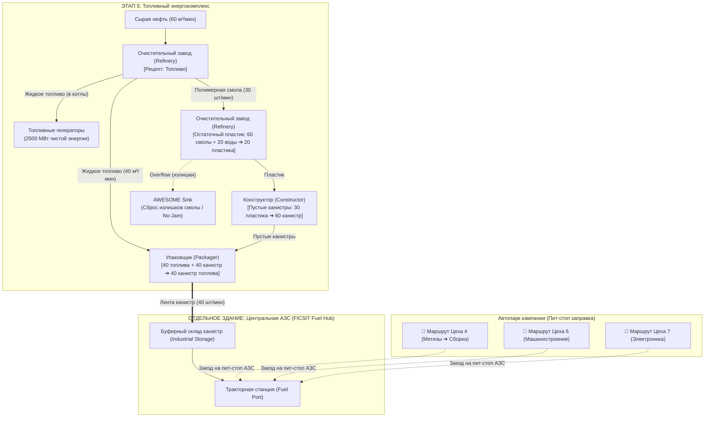

# 🗺️ Дорожная карта развития проекта (ROADMAP): FICSIT Operations

Документ содержит полную архитектуру, производственные цепочки и детальные технические спецификации ключевых подсистем развития веб-приложения:
1. **Раздел I:** Топливная логистика и Центральная АЗС FICSIT (Fuel & Service Hub).
2. **Раздел II:** Машина Молекулярного Анализа (ММА / MAM) — Исследования и Альтернативные рецепты Satisfactory 1.0.

---

# РАЗДЕЛ I. ⛽ Топливная логистика и Центральная АЗС (FICSIT Fuel Hub)

## 1. Архитектура топливной системы (FICSIT Fuel & Service Hub)

### 1.1. Проблема текущей версии сайта
В текущем движке межэтапного транзита ([`campaignTransitEngine.js`](file:///c:/Users/user/Documents/Workspace/05_Web_Apps/Satisfactory_Tools/src/engine/campaignTransitEngine.js)):
* Рассчитывается только **грузовая вместимость** (кузов на 25 слотов для трактора, стаки, дальность хода и число рейсов в минуту).
* **Топливо не учитывалось**: считалось, что заправка станций происходит игроком «вручную» или «неявно».
* В пресетах этапов ([`campaignPresets.json`](file:///c:/Users/user/Documents/Workspace/05_Web_Apps/Satisfactory_Tools/src/database/campaignPresets.json)) вся нефть направлялась в генераторы (2500 МВт) без выделения потока на заправку автопарка.

---

### 1.2. Энергетический расчет техники в Satisfactory 1.0
Каждое транспортное средство при движении потребляет постоянную мощность в среднем **~20 МВт** (1 200 МДж/мин активной езды).

| Вид топлива | Теплотворность (Энергия) | Расход на 1 Трактор | Примечание |
| :--- | :---: | :---: | :--- |
| **Уголь (`coal`)** | 300 МДж | ~4.0 шт/мин | Ранний тир (Этапы 2–4). |
| **Нефтяной кокс (`petroleum_coke`)** | 180 МДж | ~6.7 шт/мин | Побочный продукт крекинга, быстро прогорает. |
| **Канистра топлива (`packaged_fuel`)** | **750 МДж** | **~1.6 шт/мин** | **Золотой стандарт!** В 2.5 раза калорийнее угля. Бак на 100 канистр держит ~1 час езды. |
| **Упакованное турботопливо** | 2 000 МДж | ~0.6 шт/мин | Поздний тир для дальнобойных грузовиков. |
| **Поезда (Ж/Д)** | Электросеть 480V | 0 шт/мин | Питаются от общей энергосети (Grid MW). |

> [!IMPORTANT]
> **Особенность грузовых станций:** Тракторные станции (Truck Station) принимают для заправки **ТОЛЬКО твердые предметы**. Жидкое топливо напрямую по трубе в бак машины залить нельзя — его необходимо упаковывать в канистры (`packaged_fuel`).

---

## 2. Производство топлива и переработка Полимерной смолы

### 2.1. Базовый крекинг на ЭТАПЕ 5 (Топливный энергокомплекс)
* **Рецепт:** `Топливо` (Очистительный завод / Refinery)
  * **Вход:** Сырая нефть 60 м³/мин (`crude_oil: 60`)
  * **Выход:** Жидкое топливо 40 м³/мин (`fuel: 40`) + **Полимерная смола 30 шт/мин (`polymer_resin: 30`)**

---

### 2.2. Куда девать Полимерную смолу (Polymer Resin)?

В игре есть **4 сценария применения**, из которых выстраивается безотходный цикл:

1. **Остаточный пластик (`Residual Plastic`) — Главная ветка АЗС:**
   * **Рецепт:** `60 Смолы + 20 Воды ➔ 20 Пластика` (Очистительный завод).
   * **Назначение:** Пластик подается в Конструктор на производство **Пустых канистр** (`30 пластика ➔ 60 канистр`).
   * **Результат:** Замкнутый цикл! Из своей же смолы создаются канистры для упаковки жидкого топлива.
2. **Остаточная резина (`Residual Rubber`):**
   * **Рецепт:** `40 Смолы + 40 Воды ➔ 20 Резины` (Очистительный завод).
   * **Назначение:** Изоляция, кабели, теплообменники.
3. **Полиэфирная ткань (`Polyester Fabric`):**
   * **Рецепт:** `10 Смолы + 10 Воды ➔ 10 Ткани` (Очистительный завод).
   * **Назначение:** Картриджи фильтров противогазов, костюмы радиационной защиты Hazmat Suit, парашюты.
4. **Утилизатор FICSIT (AWESOME Sink) — Защита от гидроудара и заторов:**
   * Любые излишки смолы, не востребованные канистрами, через Умный разветвитель (Smart Splitter с правилом *Overflow*) сбрасываются в Утилизатор. Это гарантирует непрерывную работу НПЗ и постоянную генерацию купонов.

---

### 2.3. Схема замкнутого цикла FICSIT Fuel Hub



---

## 3. Логика движения и заправки («Пит-стоп на АЗС»)

* **Принцип:** Не строить подачу топлива к каждому цеху и каждой станции выгрузки.
* **На карте:** Возводится отдельное здание АЗС (Fuel Hub) на ключевой дорожной развязке.
* **Маршрут автопилота трактора:**
  1. `[Цех погрузки]` — загрузка грузового кузова ресурсами.
  2. `[АЗС FICSIT]` — заезд на 2-секундный пит-стоп, загрузка канистр в топливный бак.
  3. `[Цех выгрузки]` — выгрузка ресурсов в производственную линию.
* **Пропускная способность:** 1 упаковщик на 40 канистр/мин способен одновременно обеспечивать **25 активных тракторов** на всей карте!

---

## 4. План реализации топливной логистики
- [ ] Добавить предмет `packaged_fuel` и рецепты `residual_plastic`, `empty_canister`, `packaged_fuel` в базу данных.
- [ ] Добавить в цели Этапа 5 выпуск `packaged_fuel: 40 шт/мин`.
- [ ] Расчет расхода горючего в `campaignTransitEngine.js` ($\text{fuelRate} = \text{vehicleCount} \times 1.6\text{ шт/мин}$).
- [ ] Индикатор пит-стопа на карточках узлов и алерты дефицита топлива.

---
---

# РАЗДЕЛ II. 🔬 Машина Молекулярного Анализа (ММА / MAM) — Деревья Исследований 1.0

## 1. Назначение и концепция модуля

Модуль **«Машина Молекулярного Анализа» (ММА / MAM)** добавляется в верхнее меню **«ВЕРСТАК»** (`view === 'mam'`) как полномасштабная цифровая реплика внутриигрового исследовательского терминала **Satisfactory 1.0**.

### 1.1. Ключевые возможности:
1. **Интерактивные деревья технологий (Tech Trees):**
   * Все 9 оригинальных веток игры с реальными зависимостями (родительские узлы ➔ дочерние).
   * Линии прогресса со ступенчатой ортогональной разводкой FICSIT и неоновым свечением статусов.
2. **Карточки исследований:**
   * Время анализа (таймер / бейдж: 3 сек, 30 сек, 3 мин, 5 мин).
   * Необходимые материалы в инвентаре (с официальными 3D-иконками игры).
   * Разблокируемые награды (новые рецепты, здания, снаряжение, слоты инвентаря, апгрейды сканера).
3. **Трекинг прогресса первопроходца:**
   * Интерактивные отметки «Исследовано / Не исследовано» с мгновенным сохранением в `localStorage`.
   * Кнопки «Исследовать всё» (для планирования на поздних этапах) и «Сбросить прогресс».
4. **Каталог Жёстких дисков (Hard Drives):**
   * Анализ жестких дисков с симулятором выбора 1 из 3 альтернативных рецептов.
   * Полная фильтруемая база данных всех **77 альтернативных рецептов Satisfactory 1.0** с расчетом ресурсоэффективности.

---

## 2. Архитектура интерфейса ММА (Внутри «ВЕРСТАК»)

```
┌────────────────────────────────────────────────────────────────────────────────────────┐
│  ВЕРСТАК ──► МАШИНА МОЛЕКУЛЯРНОГО АНАЛИЗА (ММА / MAM)                                 │
├───────────────┬────────────────────────────────────────────┬───────────────────────────┤
│ ДЕРЕВЬЯ ММА   │ ХОЛСТ ДЕРЕВА ИССЛЕДОВАНИЙ (React Flow)     │ КАРТОЧКА ИССЛЕДОВАНИЯ     │
│               │                                            │                           │
│ 🧬 Организмы  │   [Слиток] ───► [Быстропровод] ──► [Опора] │  🟡 Быстропровод          │
│ 🔮 Технологии │       │                │                   │  ⏱️ Время: 00:03          │
│ 🟡 Катерий    │       └───► [Огранич.] ┴──► [Сплиттер]     │  📦 Стоимость:            │
│ 🍄 Мицелий    │                                            │    • 50 × Руда катерия    │
│ 🍓 Питание    │   Линии:                                   │  🎁 Награды:              │
│ 🐌 Энергослиз.│    — Золотые/неоновые (исследовано)        │    • Рецепт: Быстропровод │
│ 💎 Кварц      │    — Голубые/белые (доступно для анализа)  │    • Сканер: Катерий      │
│ 💣 Сера       │    — Темно-серые (заблокировано)           │                           │
│ 💾 Жесткие д. │                                            │  [ ИССЛЕДОВАТЬ / СБРОС ]  │
└───────────────┴────────────────────────────────────────────┴───────────────────────────┘
```

---

## 3. Подробная спецификация всех 9 Деревьев исследований (Satisfactory 1.0)

### 3.1. 🧬 Инопланетные организмы (Alien Organisms)
Ветка исследований биологических образцов планеты MASSAGE-2(A-B)b.

* **Входные узлы:**
  * Останки кабана (Hog Remains)
  * Останки плевуна (Spitter Remains)
  * Останки паука/жала (Stinger Remains)
  * Останки люка (Hatcher Remains)
* **Ключевые цепочки технологий:**
  * **Инопланетный белок (Alien Protein):** Переработка биомассы врагов в белок.
  * **Органические капсулы данных (Organic Data Capsule):** Создание ДНК-капсул FICSIT для сброса в Утилизатор за купоны.
  * **Оружие ближнего боя:** Ксено-башер (Xeno-Basher — увеличенный урон и дальность удара).
  * **Стрелковое оружие:** Ребар-ган (Rebar Gun).
  * **Специальные боеприпасы:**
    * Взрывные стрелы (Explosive Rebar)
    * Осколочные стрелы (Shatter Rebar)
    * Оглушающие стрелы (Stun Rebar)
  * **Медицина:** Медицинский ингалятор (Medicinal Inhaler на белковой основе).
  * **Инвентарь:** Дополнительные карманы (+3 слота, +3 слота).
  * **Сканер:** Обновление сканера объектов (поиск врагов и останков).

---

### 3.2. 🔮 Инопланетные технологии (Alien Technology — Satisfactory 1.0)
Новая ключевая ветка релизной версии 1.0, открывающая пространственные технологии FICSIT.

* **Входные узлы:**
  * Сфера Мерсера (Mercer Sphere)
  * Сомерпетля (Somersloop)
* **Ключевые цепочки технологий:**
  * **Межпространственное облачное депо (Dimensional Depot):**
    * Постройка загрузчика в облако (Dimensional Depot Uploader).
    * Доступ к ресурсам напрямую из облака в инвентарь первопроходца из любой точки планеты без конвейеров!
  * **Апгрейды депо:**
    * Скорость загрузки в облако (Upload Speed Mk.1–Mk.4: 60 ➔ 120 ➔ 240 шт/мин).
    * Вместимость облачного стека (Stack Capacity: 1 ➔ 2 ➔ 4 ➔ 5 стаков на предмет).
  * **Усилители производства (Production Amplifiers):**
    * Вставка Сомерпетлей в станки (Конструкторы, Сборщики, Изготовители, НПЗ).
    * Удвоение выхода готовой продукции (2× Multiplier) при сохранении исходного расхода сырья!
  * **Инвентарь:** Расширение личного инвентаря первопроходца (+6 слотов суммарно).

---

### 3.3. 🟡 Катерий (Caterium)
Ветка высокотехнологичной микроэлектроники и энергосетей FICSIT.

* **Входной узел:** Руда катерия (Caterium Ore).
* **Ключевые цепочки технологий:**
  * **Слиток катерия (Caterium Ingot)** ➔ Сканер катерия.
  * **Быстропровод (Quickwire):** Базовый проводник для передовых схем.
  * **Силовая логистика:**
    * Силовые столбы Mk.2 (7 подключений) и Mk.3 (10 подключений).
    * Настенные и потолочные силовые розетки (Ceiling Power Outlets).
    * Силовая вышка (Power Tower) и силовая вышка с площадкой (сверхдальние линии ЛЭП).
  * **Логистические разветвители:**
    * **Интеллектуальный разветвитель (Smart Splitter):** Фильтрация ресурсов по типу, сортировка мусора, правило Overflow.
    * **Программируемый разветвитель (Programmable Splitter):** Маршрутизация нескольких предметов в один выход.
  * **Электроника:**
    * Ограничитель ИИ (AI Limiter)
    * Высокоскоростной коннектор (High-Speed Connector)
    * Суперкомпьютер (Supercomputer)
  * **Личное снаряжение:**
    * Зиплайн (Zipline) — скоростное скольжение по проводам ЛЭП.
    * Защитная маска (Gas Mask) и противогазные фильтры.
    * Ховерпак (Hoverpack) — беспроводной левитирующий ранец, питающийся от проводов завода.
  * **Инвентарь:** Дополнительные карманы (+3 слота, +3 слота).

---

### 3.4. 🍄 Мицелий (Mycelia)
Ветка биохимических полимеров и индивидуальной защиты.

* **Входной узел:** Сбор мицелия (Mycelia).
* **Ключевые цепочки технологий:**
  * **Ткань (Fabric):** Синтез ткани из мицелия и древесины/листьев.
  * **Парашют (Parachute):** Многоразовый управляемый планирующий парашют (в 1.0 не расходуется).
  * **Медицина:** Медицинский ингалятор на растительной основе (восстановление 100% HP).
  * **Биотопливо:** Твердое биотопливо и упакованный биогаз.
  * **Защита:** Фильтры токсичных газов (Gas Filter).

---

### 3.5. 🍓 Питательные вещества (Nutrients)
Ветка полевой медицины, пищевых экстрактов и выживания.

* **Входные узлы:**
  * Ягоды Палеоберри (Paleberry)
  * Орехи Берилл (Beryl Nut)
  * Беконная мухоловка (Bacon Agaric)
* **Ключевые цепочки технологий:**
  * **Витаминный ингалятор (Nutritional Inhaler):** Мгновенное восстановление полного здоровья первопроходца без расхода белка.
  * **Анализ плодов:** Обновление сканера ресурсов (поиск съедобных растений).
  * **Инвентарь:** Дополнительные карманы (+3 слота).

---

### 3.6. 🐌 Энергетические слизни (Power Slugs)
Ветка разгона и регулирования тактовой частоты оборудования (Overclocking).

* **Входной узел:** Синий энергослизень (Blue Power Slug).
* **Ключевые цепочки технологий:**
  * **Разгон Mk.1:**
    * Синтез энергоосколка из синего слизня (1 осколок).
    * Разблокировка ползунка разгона станков до **150%**.
  * **Разгон Mk.2:**
    * Исследование желтого слизня (2 осколка).
    * Разгон оборудования до **200%**.
  * **Разгон Mk.3:**
    * Исследование фиолетового слизня (5 осколков).
    * Максимальный разгон оборудования до **250%**.
  * **Сканер:** Обновление сканера объектов (поиск энергослизней на карте).

---

### 3.7. 💎 Кварц (Quartz)
Ветка кристаллической оптики, радиосвязи и скоростного перемещения.

* **Входной узел:** Сырой кварц (Raw Quartz).
* **Ключевые цепочки технологий:**
  * **Кварцевый кристалл (Quartz Crystal)** ➔ Сканер кварца.
  * **Силикат (Silica):** Полупроводники, алюминий, бетон.
  * **Осколочное стекло (Structural Glass):** Прозрачные окна FICSIT, стеклянные фундаменты и рамы.
  * **Кристаллический осциллятор (Crystal Oscillator):** Сердце компьютеров и радиоприборов.
  * **Исследовательский транспорт:** Внедорожник «Исследователь» (Explorer Buggy — полный привод, высокий клиренс, скорость 100 км/ч).
  * **Радиовышка (Radar Tower):** Автоматическое открытие тумана войны на глобальной карте мира.
  * **Экзоскелет «Бегуны» (Blade Runners):** Увеличение скорости спринта на 50% и высоты прыжка в 2 раза.
  * **Инвентарь:** Дополнительные карманы (+3 слота, +3 слота).

---

### 3.8. 💣 Сера (Sulfur)
Ветка взрывчатых веществ, пиротехники и тяжелого вооружения.

* **Входной узел:** Сера (Sulfur).
* **Ключевые цепочки технологий:**
  * **Черный порох (Black Powder)** ➔ Сканер серы.
  * **Нобелиск (Nobelisk):** Детонатор нобелисков для подрыва завалов, треснувших скал и ядовитых спор.
  * **Специальные нобелиски:**
    * Газовый нобелиск (Gas Nobelisk) — токсичное облако.
    * Ударный нобелиск (Pulse Nobelisk) — мощная ударная волна для рокет-джампов и отбрасывания врагов.
    * Кластерный нобелиск (Cluster Nobelisk) — кассетный взрыв огромного радиуса.
    * Ядерный нобелиск (Nuke Nobelisk) — тактический ядерный боеприпас колоссальной мощности.
  * **Огнестрельное оружие:**
    * Автоматическая винтовка FICSIT (Rifle).
    * Стандартные патроны (Rifle Ammo).
    * Самонаводящиеся пули (Homing Rifle Ammo — автоприцеливание в воздухе).
    * Турбо-патроны (Turbo Rifle Ammo — чудовищный темп стрельбы).
  * **Энергетика:**
    * Компактный уголь (Compacted Coal: уголь + сера).
    * Турботопливо (Turbofuel: тяжелый остаток/топливо + сера).
  * **Инвентарь:** Дополнительные карманы (+3 слота).

---

### 3.9. 💾 Жёсткие диски (Hard Drives & Alternate Recipes)
Инструмент анализа разбившихся капсул FICSIT (Drop Pods).

* **Механика сканирования:**
  * Анализ жесткого диска длится **10 минут**.
  * По завершении игроку предлагается выбор из **3 случайных альтернативных рецептов**.
* **Каталог 77 Альтернативных рецептов Satisfactory 1.0:**
  * Интерактивная таблица всех 77 рецептов с удобными фильтрами:
    * По тирам (Тир 1–2, Тир 3–4, Тир 5–6, Тир 7–8, Тир 9).
    * По станкам (Конструктор, Сборщик, Изготовитель, Очистительный завод, Блендер).
    * По ключевому ресурсу (Железо, Медь, Сталь, Нефть, Катерий, Кварц, Алюминий).
  * Индикаторы эффективности: сравнение со стандартным рецептом (экономия сырья в %, экономия энергопотребления).

---

## 4. Пошаговый технический план реализации

### Этап 4.1. База данных исследований ([`src/database/mamData.json`](file:///c:/Users/user/Documents/Workspace/05_Web_Apps/Satisfactory_Tools/src/database/mamData.json))
- [ ] Собрать структурированный JSON со всеми 9 деревьями исследований:
  - Идентификатор категории, название, иконка, акцентный цвет.
  - Массив узлов (`id`, `name`, `treeId`, `tier`, `icon`, `timeSeconds`, `cost`, `rewards`, `parents`, координаты сетки `x`, `y`).
  - Связи `edges` (`source` ➔ `target`).

### Этап 4.2. Стор управления состоянием ([`src/store/useMamStore.js`](file:///c:/Users/user/Documents/Workspace/05_Web_Apps/Satisfactory_Tools/src/store/useMamStore.js))
- [ ] Реализовать Zustand-хранилище:
  - `selectedTreeId` (активная ветка исследований).
  - `selectedNodeId` (активный узел в правой панели инспектора).
  - `researchedNodes` (набор открытых узлов, сохраняемый в `localStorage`).
  - Экшены: `toggleNode(id)`, `researchAll()`, `resetTree(treeId)`, `resetAll()`.
  - Вычисляемые свойства: проверка доступности узла (`isAvailable(id) = parents.every(p => researchedNodes.has(p))`).

### Этап 4.3. Визуальные компоненты графа исследований (`src/modules/mam/components/`)
- [ ] **`MamNode.jsx`:** Шестиугольный/скругленный металлический узел в стиле Satisfactory с 3D-иконкой, временем, статусом (Заблокировано / Доступно / Исследовано).
- [ ] **`MamEdge.jsx`:** Ортогональные ступени с FICSIT-свечением (золотой неоновый контур для завершенных путей, голубой для доступных, серый для закрытых).
- [ ] **`MamCategorySidebar.jsx`:** Левая колонка с 9 ветками ММА, прогресс-барами и бейджами количества открытых технологий.
- [ ] **`MamDetailPanel.jsx`:** Правая инспекционная панель с детальными затратами, таймером анализа, списком наград и кнопкой «Исследовать».
- [ ] **`HardDriveCatalog.jsx`:** Каталог всех 77 альтернативных рецептов с поиском и сравнением выгоды.
- [ ] **`MamViewer.jsx`:** Главный экран модуля ММА.

### Этап 4.4. Интеграция в навигацию ([`src/App.jsx`](file:///c:/Users/user/Documents/Workspace/05_Web_Apps/Satisfactory_Tools/src/App.jsx))
- [ ] Добавить в дропдаун **«ВЕРСТАК»** кнопку **«Машина Молекулярного Анализа (ММА)»**.
- [ ] Подключить `view === 'mam'` через `React.lazy` для оптимизации размера бандла.

### Этап 4.5. Тестирование и верификация
- [ ] Модульные тесты связности графа деревьев ММА (`npx vitest run`).
- [ ] Проверка чистоты production-сборки (`npm run build`).
- [ ] Проверка сохранения прогресса в `localStorage`.
