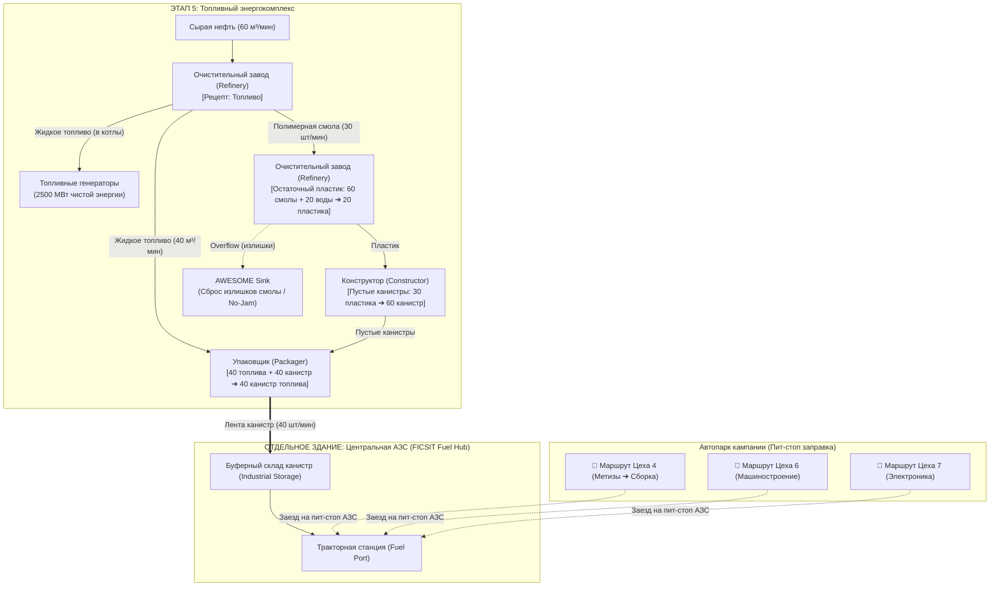

# 🗺️ Дорожная карта развития (ROADMAP): Топливная логистика и АЗС FICSIT

Документ содержит полную архитектуру, производственные цепочки и технический план реализации **системы снабжения топливом автомобильного транспорта (Тракторы и Грузовики)** через отдельную **Центральную АЗС (FICSIT Fuel Hub)** и нефтехимию **ЭТАПА 5**, а также статус оптимизации комплексов кампании.

---

## ⛽ 1. Архитектура топливной системы (FICSIT Fuel & Service Hub)

### 1.1. Проблема текущей версии сайта
В текущем движке межэтапного транзита ([`campaignTransitEngine.js`](file:///c:/Users/user/Documents/Workspace/05_Web_Apps/Satisfactory_Tools/src/engine/campaignTransitEngine.js)):
* Рассчитывается только **грузовая вместимость** (кузов на 25 слотов для трактора, стаки, дальность хода и число рейсов в минуту).
* **Топливо не учитывалось**: считалось, что заправка станций происходит игроком «вручную» или «неявно».
* В пресетах этапов ([`campaignPresets.json`](file:///c:/Users/user/Documents/Workspace/05_Web_Apps/Satisfactory_Tools/src/database/campaignPresets.json)) вся нефть направлялась в генераторы (2500 МВт) без выделения потока на заправку автопарка.

---

### 1.2. Энергетический расчет техники в Satisfactory 1.0
Каждое транспортное средство при движении потребляет постоянную мощность в среднем **~20 МВт** (1 200 МДж/мин активной езды).

| Вид топлива | Теплотворность (Энергия) | Расход на 1 Трактор | Примечание |
| :--- | :---: | :---: | :--- |
| **Уголь (`coal`)** | 300 МДж | ~4.0 шт/мин | Ранний тир (Этапы 2–4). |
| **Нефтяной кокс (`petroleum_coke`)** | 180 МДж | ~6.7 шт/мин | Побочный продукт крекинга, быстро прогорает. |
| **Канистра топлива (`packaged_fuel`)** | **750 МДж** | **~1.6 шт/мин** | **Золотой стандарт!** В 2.5 раза калорийнее угля. Бак на 100 канистр держит ~1 час езды. |
| **Упакованное турботопливо** | 2 000 МДж | ~0.6 шт/мин | Поздний тир для дальнобойных грузовиков. |
| **Поезда (Ж/Д)** | Электросеть 480V | 0 шт/мин | Питаются от общей энергосети (Grid MW). |

> [!IMPORTANT]
> **Особенность грузовых станций:** Тракторные станции (Truck Station) принимают для заправки **ТОЛЬКО твердые предметы**. Жидкое топливо напрямую по трубе в бак машины залить нельзя — его необходимо упаковывать в канистры (`packaged_fuel`).

---

## 🧪 2. Производство топлива и переработка Полимерной смолы

### 2.1. Базовый крекинг на ЭТАПЕ 5 (Топливный энергокомплекс)
* **Рецепт:** `Топливо` (Очистительный завод / Refinery)
  * **Вход:** Сырая нефть 60 м³/мин (`crude_oil: 60`)
  * **Выход:** Жидкое топливо 40 м³/мин (`fuel: 40`) + **Полимерная смола 30 шт/мин (`polymer_resin: 30`)**

---

### 2.2. Куда девать Полимерную смолу (Polymer Resin)?

В игре есть **4 сценария применения**, из которых выстраивается безотходный цикл:

1. **Остаточный пластик (`Residual Plastic`) — Главная ветка АЗС:**
   * **Рецепт:** `60 Смолы + 20 Воды ➔ 20 Пластика` (Очистительный завод).
   * **Назначение:** Пластик подается в Конструктор на производство **Пустых канистр** (`30 пластика ➔ 60 канистр`).
   * **Результат:** Замкнутый цикл! Из своей же смолы создаются канистры для упаковки жидкого топлива.
2. **Остаточная резина (`Residual Rubber`):**
   * **Рецепт:** `40 Смолы + 40 Воды ➔ 20 Резины` (Очистительный завод).
   * **Назначение:** Изоляция, кабели, теплообменники.
3. **Полиэфирная ткань (`Polyester Fabric`):**
   * **Рецепт:** `10 Смолы + 10 Воды ➔ 10 Ткани` (Очистительный завод).
   * **Назначение:** Картриджи фильтров противогазов, костюмы радиационной защиты Hazmat Suit, парашюты.
4. **Утилизатор FICSIT (AWESOME Sink) — Защита от гидроудара и заторов:**
   * Любые излишки смолы, не востребованные канистрами, через Умный разветвитель (Smart Splitter с правилом *Overflow*) сбрасываются в Утилизатор. Это гарантирует непрерывную работу НПЗ и постоянную генерацию купонов.

---

### 2.3. Схема замкнутого цикла FICSIT Fuel Hub

---

## 🚗 3. Логика движения и заправки («Пит-стоп на АЗС»)

* **Принцип:** Не строить подачу топлива к каждому цеху и каждой станции выгрузки.
* **На карте:** Возводится отдельное здание АЗС (Fuel Hub) на ключевой дорожной развязке.
* **Маршрут автопилота трактора:**
  1. `[Цех погрузки]` — загрузка грузового кузова ресурсами.
  2. `[АЗС FICSIT]` — заезд на 2-секундный пит-стоп, загрузка канистр в топливный бак.
  3. `[Цех выгрузки]` — выгрузка ресурсов в производственную линию.
* **Пропускная способность:** 1 упаковщик на 40 канистр/мин способен одновременно обеспечивать **25 активных тракторов** на всей карте!

---

## 💻 4. План технической реализации в веб-приложении

### Этап 4.1. База данных ([items.json](file:///c:/Users/user/Documents/Workspace/05_Web_Apps/Satisfactory_Tools/src/database/items.json) и [recipes.json](file:///c:/Users/user/Documents/Workspace/05_Web_Apps/Satisfactory_Tools/src/database/recipes.json))
- [ ] Добавить предмет `packaged_fuel` (Канистра топлива, 750 МДж, стак 100, иконка `/icons/Items/Fuel.png`).
- [ ] Добавить рецепты:
  - `residual_plastic` (Остаточный пластик из смолы и воды).
  - `empty_canister` (Пустая канистра из пластика).
  - `packaged_fuel` (Упакованное топливо в Packager).

### Этап 4.2. Обновление пресета Этапа 5 ([campaignPresets.json](file:///c:/Users/user/Documents/Workspace/05_Web_Apps/Satisfactory_Tools/src/database/campaignPresets.json))
- [ ] Добавить в цели Этапа 5 выпуск `packaged_fuel: 40 шт/мин` для покрытия нужд АЗС.

### Этап 4.3. Движок сквозного транзита ([campaignTransitEngine.js](file:///c:/Users/user/Documents/Workspace/05_Web_Apps/Satisfactory_Tools/src/engine/campaignTransitEngine.js))
- [ ] Реализовать расчет расхода топлива для каждого автомобильного маршрута:
  $$\text{fuelRate} = \text{vehicleCount} \times 1.6\text{ шт/мин}$$
- [ ] Привязать маршруты к АЗС (Этап 5).
- [ ] Добавить проверку статуса: если Этап 5 отключен или производит меньше требуемого, выставлять флаг `fuelDeficit: true`.

### Этап 4.4. Интерфейс (UI)
- [ ] **[MachineNode.jsx](file:///c:/Users/user/Documents/Workspace/05_Web_Apps/Satisfactory_Tools/src/components/canvas/MachineNode.jsx):** Добавить в карточку транзита индикатор заправки:
  `⛽ Пит-стоп АЗС: Канистра топлива (1.6 шт/мин) [← Этап 5: FICSIT Fuel Hub]`.
- [ ] **[MainView.jsx](file:///c:/Users/user/Documents/Workspace/05_Web_Apps/Satisfactory_Tools/src/components/canvas/MainView.jsx):** Отображение статуса обеспечения топливом в таблице логистики.
- [ ] **[DeficitAlerts.jsx](file:///c:/Users/user/Documents/Workspace/05_Web_Apps/Satisfactory_Tools/src/components/logistics/DeficitAlerts.jsx):** Вывод предупреждений в случае дефицита горючего для автопарка.
- [ ] **[MacroView.jsx](file:///c:/Users/user/Documents/Workspace/05_Web_Apps/Satisfactory_Tools/src/components/canvas/MacroView.jsx):** Отображение топливных связей от АЗС к транспортным узлам на SCADA-карте.

